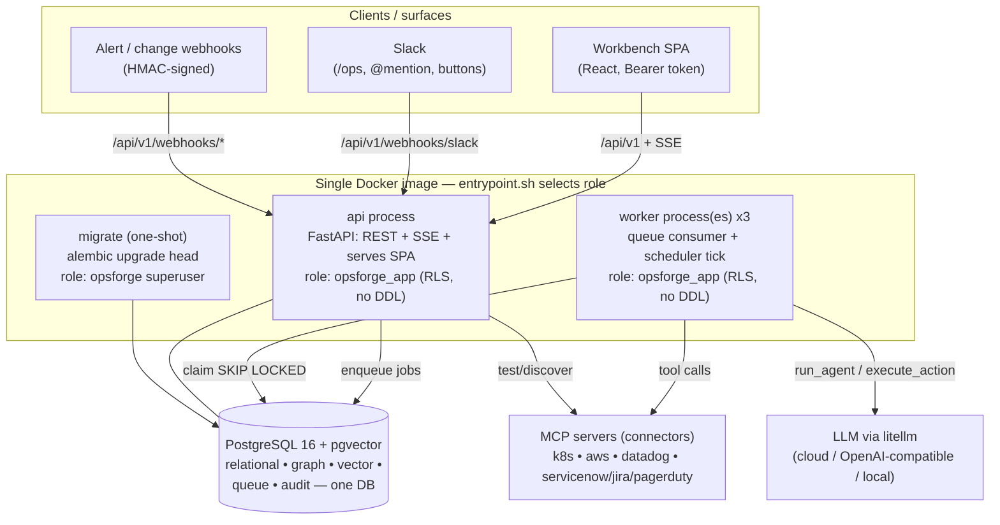
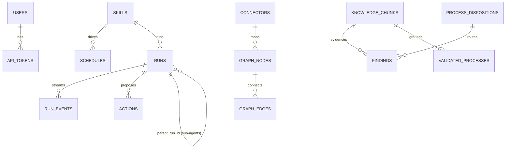
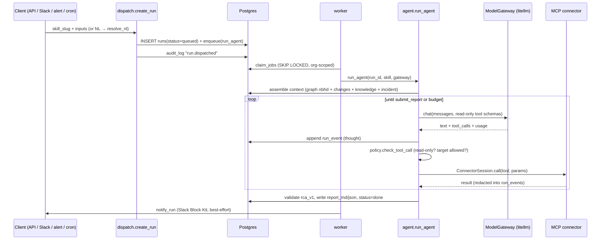
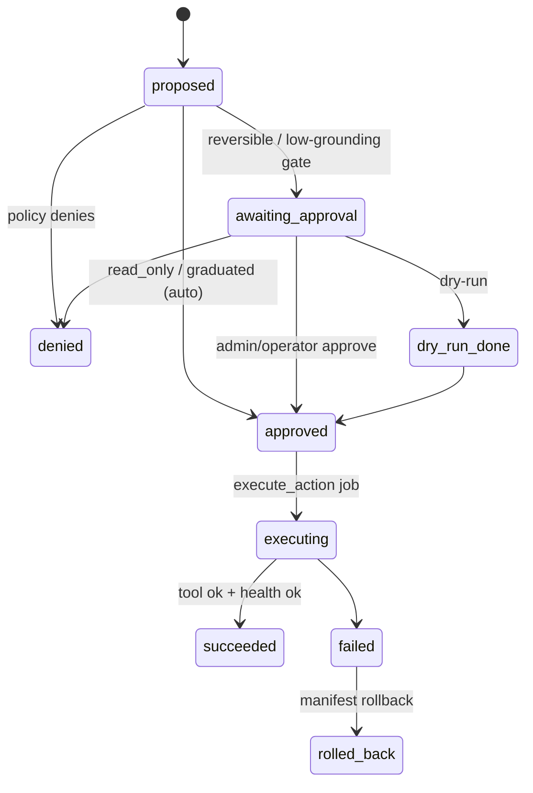
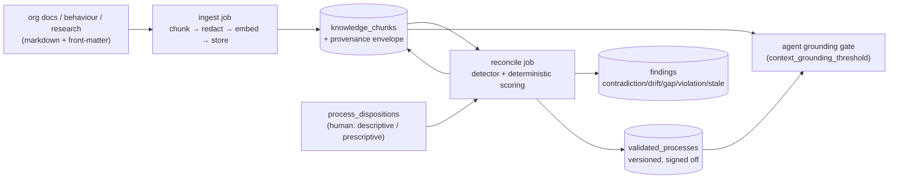

# OpsForge — As-Built Architecture

> **What this is.** A description of the system *as the code actually implements it today*,
> derived by reading the source. The companion document [ARCHITECTURE.md](ARCHITECTURE.md) is
> the original **build specification** (the v1.0 plan, M0→M5). This document reflects reality,
> which has since grown past that plan — most notably a whole **Knowledge & Truth Plane (M6)**,
> Postgres row-level security, an ITSM/canonical-ops layer, and several hardening fixes.
> Where the two differ, this file wins for "what runs"; the spec wins for "why".

---

## 1. What OpsForge is

A self-hosted **agentic operations runtime** ("AI SRE"). An org runs it in their own
infrastructure, plugs in **connectors** (MCP servers for cloud / Kubernetes / observability /
ITSM), installs **skills** (versioned capability packs), and dispatches **agents** — instantly,
on events (alert webhook), or on cron schedules.

An agent investigates by traversing an **operational graph** (topology fused with a change
timeline) and an org **knowledge plane** (ingested docs/behaviour with provenance), produces an
**evidence-chained RCA report**, and proposes actions that pass through a deterministic **trust
ladder** (`read_only → reversible → destructive`) with approval gates, dry-run, auto-rollback,
and an immutable audit trail.

**Shipped milestones (per README + code):** M0 skeleton, M1 connectors+graph, M2 agent loop +
skills + evals, M3 Slack + schedules + alert ingest (Phase-1 MVP), M4 workbench SPA, M5 live
trust ladder (executor / approvals / graduation / sub-agents / Helm), and **M6 Knowledge & Truth
Plane** (ingest, reconciliation, dispositions, findings, validated processes, grounding gate).

---

## 2. Architecture doctrine (as enforced in code)

These are the original doctrines, annotated with how they actually show up:

1. **One database.** PostgreSQL 16 + pgvector is the relational store, graph store
   (`graph_nodes`/`graph_edges`), vector store (pgvector on `patterns` + `knowledge_chunks`),
   the job queue (`FOR UPDATE SKIP LOCKED`), and the audit log. No Redis/Kafka/Neo4j.
2. **Two processes, one image.** `api` (FastAPI: REST + SSE + SPA) and `worker` (queue consumer
   + scheduler tick). Same package, same Docker image, different `entrypoint.sh` argument.
   Workers scale horizontally (`replicas: 3`).
3. **The LLM never executes anything.** `agent.py` is the *only* module that runs the LLM. It
   emits *proposals* (rows in `actions`). A deterministic policy engine (`policy.py`, pure
   functions) + executor (`actions.py`) decide and perform. This is enforced by an
   **import-linter** contract: `opsforge.policy` may not import `opsforge.agent`.
4. **Connectors are configuration, not code.** Every external system is an MCP server. OpsForge
   ships an MCP client, a connector registry, per-connector tool allowlists, and declarative
   field mappings — zero bespoke integrations.
5. **Skills are directories, not plugins.** A skill is a folder: `skill.yaml` manifest +
   `INSTRUCTIONS.md` + `evals/`. Validated against `opsforge/skill/v1` at install time.
6. **Append-only where it matters.** `run_events` and `audit_log` are insert-only, enforced by
   a DB trigger (`reject_mutation()`), not by convention. `process_dispositions`, `findings`,
   and `validated_processes` are append-only by discipline + monotonic `seq`.
7. **Minimum code.** ~7.2k lines of Python, no LangChain/LangGraph; the agent loop is hand-rolled.
8. **Every secret encrypted at rest** (Fernet). Plaintext credentials decrypt only at MCP spawn,
   never touch logs / `run_events` / LLM context. One `redact()` function is called at every
   boundary.
9. **Modular monolith, enforced.** Module boundaries are checked by an import-linter **layered
   contract** (see §5). The extraction seams (worker, ModelGateway, graph sync) stay clean.

**Truth-Plane doctrines added with M6** (visible in `knowledge.py` / `reconcile.py` / `confidence.py`):

- **No fact without provenance.** A chunk is unrepresentable without a full `ProvenanceEnvelope`
  (`source_kind`, `source_ref`, `observed_at ≠ ingested_at`) — the same way the kernel refuses
  an action without a `policy_trace`.
- **Precedence is derived, never free-typed.** `behaviour (3) > document (2) > research (1)`;
  confidence is a deterministic formula over evidence, not an LLM judgement.
- **The human owns the policy decision.** Whether a process is *descriptive* (reality wins) or
  *prescriptive* (the doc is law) is a human declaration; the system never guesses it.
- **The LLM proposes, deterministic code disposes.** The model only *detects* relations and
  *drafts* steps; scoring, supersession, findings, and versioning are pure Python.

---

## 3. Tech stack (as locked in `pyproject.toml`)

| Layer | Choice |
|---|---|
| Language | Python 3.12, typed, Pydantic v2 |
| Packaging | hatchling + `uv`, single `pyproject.toml`; console script `opsforge = opsforge.cli:main` |
| API | FastAPI + uvicorn (async, SSE, OpenAPI) |
| ORM / migrations | SQLAlchemy 2 async + Alembic (hand-written initial migration) |
| DB | PostgreSQL 16 + pgvector (`pgvector/pgvector:pg16`), driver `postgresql+psycopg://` (psycopg3) |
| Job queue | `jobs` table + `FOR UPDATE SKIP LOCKED` polling |
| Scheduler | Worker tick (≈30s) over `schedules`, cron via `croniter` |
| LLM gateway | `litellm` behind a one-file `ModelGateway` protocol (BYO model = config string) |
| Connectors | `mcp` (official Python SDK), stdio + streamable-http transports |
| Embeddings | through `ModelGateway.embedding()`, stored in pgvector(1536) |
| Frontend | Vite + React 18 + TypeScript + Tailwind 3 + React Router 6 + TanStack Query 5, served by FastAPI static |
| Live updates | SSE (`/runs/{id}/events`), fetch-based reader (carries Bearer token) |
| Slack | raw Events API + Web API over httpx (no Bolt) |
| Crypto | `cryptography` Fernet credential envelopes |
| Tests | pytest + pytest-asyncio; in-repo fake MCP servers; golden eval scenarios |
| Deploy | Docker Compose (db/migrate/api/worker) **and** a Helm chart (`deploy/helm/opsforge/`) |
| Boundaries | `import-linter` layered + forbidden contracts |

---

## 4. Process & deployment topology



- **One image, three roles.** `docker/entrypoint.sh` switches on `$1`: `migrate` →
  `alembic upgrade head`; `api` → `uvicorn opsforge.main:app`; `worker` → `python -m
  opsforge.worker`.
- **Least privilege.** `migrate` connects as the **superuser** `opsforge` (needs DDL + creates
  the app role). `api`/`worker` connect as the **restricted** `opsforge_app` role
  (`NOSUPERUSER NOBYPASSRLS`, DML only) so row-level security is genuinely enforced.
- **Compose ordering:** `db` (healthcheck `pg_isready`) → `migrate` (runs once,
  `service_completed_successfully`) → `api` + 3× `worker`.
- **Helm** mirrors this: a pre-install/pre-upgrade migrate Job, an api Deployment + Service,
  a worker Deployment, an optional bundled Postgres StatefulSet (or `externalDatabaseUrl`),
  and a Secret for the Fernet key / webhook / Slack secrets.

---

## 5. Module map & layering

All server code is one package, `server/opsforge/`. The **import-linter layered contract**
forbids lower layers from importing higher ones, and forbids intra-layer imports. Top → bottom:

```
api | surfaces                                  ← HTTP routers + Slack
agent | actions | dispatch | ingest | reconcile | processes   ← orchestration
reports                                          ← rca_v1 + rendering
policy                                           ← deterministic trust engine
skills | graph | ops_adapter | knowledge | confidence | dispositions | findings
connectors | gateway                             ← MCP client + LLM boundary
security                                          ← auth, Fernet vault, redact()
models | ops_model                               ← ORM + canonical ops vocabulary
db                                               ← engine, session, queue, RLS helpers
config                                           ← pydantic-settings (all env)
```

Plus an explicit `forbidden` contract: **`opsforge.policy` must not import `opsforge.agent`**
(doctrine #3 — the decider must never reach into the LLM loop).

| Module | Responsibility |
|---|---|
| `config.py` | `Settings` (pydantic-settings, env prefix `OPSFORGE_`), `get_settings()` (lru-cached), `DEFAULT_ORG_ID`. The single place env is read. |
| `db.py` | Async engine/session singletons; the SKIP-LOCKED queue (`enqueue`/`claim_jobs`/`complete_job`/`fail_job`); `scope_to_org()` RLS GUC; `append_run_event()`; `record_audit()`. |
| `security.py` | Bearer-token auth (`require_token` → `Principal`), token hashing/minting, webhook HMAC, Fernet `encrypt`/`decrypt`, and the recursive `redact()` chokepoint. |
| `models.py` | All 19 SQLAlchemy models in one file; `ALL_TABLES` tuple guarded by a test. |
| `ops_model.py` | Canonical vendor-neutral ops vocabulary (`Incident`/`Change`/`Problem`/`ServiceCI`), `from_native()` translation, `validate_mapping()`, starter-pack loader. |
| `gateway.py` | `ModelGateway` protocol (`chat`/`embedding`) + the one `LiteLLMGateway` impl; wire-message helpers; token-usage extraction. |
| `connectors.py` | MCP client lifecycle (per-scope sessions, not long-pooled), tool discovery ∩ allowlist, `ConnectorSession.call()` with redacted `run_events`, health-check, `discover()`. |
| `graph.py` | Per-kind mappers → `GraphDelta`; idempotent upsert by `natural_key` (JSONB merge); recursive 2-hop `neighborhood()`; compact text rendering for LLM context. |
| `knowledge.py` | `ProvenanceEnvelope`/`PendingChunk`; chunk store (insert/query/score/supersede); the `behaviour>document>research` source-rank map. |
| `confidence.py` | Pure deterministic confidence formula + explainable `ConfidenceBreakdown`. |
| `dispositions.py` | Human descriptive/prescriptive declarations (append-only, latest-wins, audited). |
| `findings.py` | The reconciliation findings record + lifecycle (`open→acknowledged/resolved/dismissed`). |
| `policy.py` | Pure trust engine: `effective_trust`, `check_tool_call`, `resolve_proposal`, change-freeze + priority-role rules; emits replayable `policy_trace`. |
| `reports.py` | The `rca_v1` Pydantic model + markdown + Slack Block Kit rendering; `submit_report` JSON schema. |
| `reconcile.py` | Deterministic reconciliation: score chunks, supersede stale, emit findings routed by disposition; `LexicalDetector` dev stand-in. |
| `processes.py` | Generate/version/sign-off **validated processes**; step confidence = min of grounding chunks; `OutlineDrafter` dev stand-in. |
| `ingest.py` | Markdown → front-matter → heading-aware chunk → redact → embed → store with provenance. |
| `ops_adapter.py` | Connector boundary returning **canonical** ops objects (MCP call + `from_native`). |
| `actions.py` | The live trust-ladder executor: approve/dry-run/deny, atomic state machine, health gate, auto-rollback, audit + mirrored run-events. |
| `dispatch.py` | The single "start a run" path; NL intent resolution; alert→schedule matching. Shared by API, Slack, scheduler. |
| `agent.py` | The agent loop (the only LLM site): context assembly, bounded tool loop, reserved `submit_report`/`propose_action`/`dispatch_subagent`, sub-agent recursion, grounding gate. |
| `skills.py` | Manifest schema + validation, loader/installer, scaffolder, lookups. |
| `worker.py` | Worker entrypoint: handler table per job kind, queue drain loop, throttled scheduler tick (cron + due syncs). |
| `cli.py` | `opsforge` CLI: `skill new/install`, `skills sync`, `token create`. |
| `main.py` | FastAPI app factory: mounts routers + Slack, `/healthz`, SPA static fallback; installs built-in skills at startup. |
| `api/*.py` | REST routers under `/api/v1` (see §9). |
| `surfaces/slack.py` | Slack Events API surface (4-function adapter: `on_message`/`on_action`/`render_report`/`notify`). |

---

## 6. Data model

19 tables. Every table carries `id UUID` (`gen_random_uuid()`), `created_at`, and `org_id`
(a constant UUID tag in v1 — no `orgs` table, no FK; multi-tenancy without a migration rewrite).
Enum-like columns are `VARCHAR + CHECK` mirrored by Python `Literal[...]` (no native PG enums).



**Identity & config:** `users` (role admin|operator|viewer), `api_tokens` (sha256 hash only),
`connectors` (kind, transport, `endpoint`, `credentials_enc` Fernet bytea, `tool_allowlist`,
`field_mapping`, `discovered_schema`, status), `skills` (slug, version, `manifest` jsonb,
`instructions`, source builtin|org|codified, `trust_overrides`, enabled; unique per org+slug).

**Dispatch & execution:** `schedules` (cron|event, `cron_expr`, `event_filter`, `next_run_at`,
`last_run_id`), `runs` (status, `parent_run_id`, `trigger` jsonb, model, `report_md`/`report_json`,
token counts, `cost_usd`), `run_events` (**append-only**, `seq` per run, kind, redacted payload —
the SSE source), `jobs` (the queue: kind, payload, status, `run_after`, `locked_by`, `attempts`).

**Trust ladder:** `actions` (action_class, tool, params, `target_ref`, `rollback`, state machine
column, `policy_trace`, approver + timestamps, result), `audit_log` (**append-only**, monotonic
`seq bigserial`, actor, event, subject_ref, detail).

**Operational graph:** `graph_nodes` (kind, `natural_key` UNIQUE, props, source connector,
`last_seen_at`), `graph_edges` (src/dst, kind, props; unique `(src,dst,kind)`), `changes` (kind,
ref, summary, diff, `target_keys[]`, `occurred_at`; unique `(source_connector_id,kind,ref)`).

**Learning (created, populated later):** `patterns` (summary, `embedding vector(1536)`,
resolution, outcome; ivfflat index), `feedback` (verdict accepted|edited|ignored).

**Knowledge & Truth Plane (M6):**
- `knowledge_chunks` — content + `embedding vector(1536)` + provenance envelope
  (`source_kind`, `source_ref`, `source_rank`, `observed_at`, `ingested_at`) + reconciliation
  output (`confidence ∈ [0,1]`, `corroborated_by`, `contradicted_by`, `superseded_by`,
  `process_disposition`, `reconciliation_id`); `process_key` set by clustering.
- `process_dispositions` — append-only human declarations (descriptive|prescriptive),
  `declared_by`, `rationale`, monotonic `seq`; latest per `(org, process_key)` wins.
- `findings` — contradiction|drift|gap|violation|stale, `evidence_refs` (chunk ids), confidence,
  state open|acknowledged|resolved|dismissed, monotonic `seq`.
- `validated_processes` — versioned current-version process; `steps` jsonb each carrying its own
  provenance; status draft|signed_off|superseded; `min_confidence`; unique `(org,process_key,version)`.

---

## 7. Key flows

### 7.1 Dispatch → agent loop → report



- **NL resolution** (`dispatch.resolve_nl`) is deterministic keyword matching over skill
  slug/name/description; score 0 falls back to `incident-investigation`; a genuine tie returns
  `ambiguous` + candidates (never guesses). It can also extract an `incident_ref`.
- **Context assembly** is fully deterministic (no LLM): skill instructions, the query, optional
  incident ref, validated-process knowledge (if a `process_key` is bound), the 2-hop graph
  neighborhood of fuzzily-matched root nodes, recent `changes` in the manifest window (default
  24h), and a canonical incident block translated from whatever ITSM connector is present.
- **Tool exposure** = manifest `tools:` ∩ connector allowlist, only `read_only` classes; the
  reserved `submit_report` is always present, `propose_action` only if the manifest declares
  `proposals:`, `dispatch_subagent` only if it declares `subagents:` and depth `< 2`.
- **Budgets:** `max_tool_calls` (default 25) bounds real tool calls; the loop runs
  `max_tool_calls + 5` model turns. There is currently **no wall-clock budget** in the loop.
- **No-bluff contract:** the final report is validated against `rca_v1`; an invalid submission is
  returned to the model with the error to retry. A run that never submits still yields a
  `low`-confidence `_incomplete_report` with `missing_evidence` — never nothing.
- **Cooperative cancellation:** each iteration re-checks run status; `cancelled` finalizes early.
- **Sub-agents** are a tree of contracts: `dispatch_subagent` creates a child `runs` row
  (`parent_run_id` set, `trigger.kind=subagent`), recurses `run_agent(depth+1)`, and returns only
  the child's typed `rca_v1` report. No shared scratchpads, no sibling chatter.

### 7.2 Connectors & operational graph

- A `ConnectorSession` is opened **per scope** (one mapper run or agent run), not pooled
  long-term, so a dead subprocess can't leak a stale session. Credentials are decrypted from
  `credentials_enc` and injected **only at spawn** — env for stdio, headers for http.
- `list_tools()` returns `{kind}.{name}` only for allowlisted tools; no wildcards.
- `call()` writes a redacted `tool_call`/`tool_result` pair to `run_events`, returns the
  un-redacted payload to the caller, raises `ConnectorError` on tool error (redacted).
- **Graph sync** (`sync_connector`, the `graph_sync` job, due every `graph_sync_interval_s`=600s)
  runs the per-kind mapper → `GraphDelta` → idempotent upsert by `natural_key`
  (`ON CONFLICT ... props = props || EXCLUDED.props`, so multiple connectors merge onto one node).
  Service identity is connector-neutral `service://<name>`, the fusion point across K8s topology,
  observability telemetry, and CMDB.
- Mappers: `map_kubernetes` (nodes/pods/deployments→changes), `map_aws` (EC2 VMs),
  `map_observability` (datadog/custom/default — enriches services with health), `map_servicenow`
  (ITSM/CMDB — used for servicenow **and** jira **and** pagerduty).
- `neighborhood(key, hops=2)` is a `WITH RECURSIVE` undirected CTE returning nodes and only the
  edges whose both endpoints are in the reachable set; `render_neighborhood` compacts it to text.

### 7.3 Trust ladder & action execution (Phase 2 live)



- Proposals come only from the agent's `propose_action`; `policy.resolve_proposal` produces a
  `policy_trace` (which rules fired) and a state. `read_only` auto-allows; `reversible` →
  `awaiting_approval` unless the tool was **graduated** (`trust_overrides[tool]=auto_with_notify`,
  an admin act recorded in audit after ≥ `graduation_min_executions` clean runs); `destructive`
  always gates and is never gradable.
- **Low-grounding gate (M6.5):** if the proposal rides on low-confidence knowledge, an
  `auto_allow` is *downgraded* to `awaiting_approval` (rule `low_grounding_gate`). The gate can
  only reduce autonomy, never grant it.
- The executor (`execute_action`, a worker job) **re-checks the policy_trace** (defense in depth —
  refuses any action lacking a permissive trace), defers during change-freeze windows, transitions
  `approved→executing`, calls the tool, runs a post-exec health check, then `→succeeded` or
  `→failed→rolled_back` (auto-rollback if the manifest defines one). Every transition is an atomic
  `UPDATE ... WHERE state=:from` (race-safe), writes an `audit_log` row, and mirrors a `proposal`
  run-event into the live SSE timeline.
- Approval requires role admin/operator and honors priority escalation
  (`requires_role_for_priority`, e.g. P1 needs admin). Humans approve; the queue executes — the
  human is never in the hot execution path.

### 7.4 Knowledge & Truth Plane (M6)



1. **Ingest** (`ingest` job): markdown → strip front-matter → heading-aware chunks (≤1200 chars)
   → `redact()` → embed → `store_chunks` (one transaction per file). `observed_at` comes from
   front-matter (`observed_at`/`updated`/`date`) or file mtime — **never ingest time**.
   Front-matter may only *demote* a chunk's `source_kind` to document/research; it can never
   self-assert `behaviour` (rank integrity). Dev uses a keyless `hash_embedder`; production uses
   the gateway.
2. **Reconcile** (`reconcile` job): the injected detector (dev: `LexicalDetector` by Jaccard
   overlap; prod: the LLM gateway) proposes per-pair `agrees`/`contradicts`. Everything after is
   pure Python: stale pairs (same source kind, age gap ≥ `reconcile_staleness_days`) supersede the
   older; survivors get a deterministic `confidence` (from `confidence.py`,
   `clamp01(w_source·rank/3 + w_fresh·decay(age) + w_corroborate·sat(corr) − w_contradict·sat(contra))`);
   real contradictions become **findings** routed by disposition.
3. **Dispositions** decide how behaviour↔document conflicts resolve: *descriptive* → `drift`
   (behaviour wins, propose doc update); *prescriptive* → `violation` (doc is law); *undeclared*
   → `contradiction` (resolves nothing, asks a human to declare). A finding **never
   auto-resolves** — it routes a human.
4. **Validated processes** (`processes.generate_process`): a drafter (dev: `OutlineDrafter`)
   proposes steps; the deterministic layer re-grounds each step (`confidence = min of its source
   chunks`; unscored/ungrounded = 0.0) and flags low-confidence steps. Regenerating mints a new
   version and supersedes the prior. Sign-off reuses the kernel approval + audit.
5. **Grounding gate** closes the loop: when a run is bound to a `process_key`, `assemble_context`
   injects the scored chunks (high-confidence as fact, low as `[UNVERIFIED]`, none as "acting
   blind") and computes a grounding summary (best available confidence). That summary flows into
   `policy.resolve_proposal`, which downgrades autonomy when grounding is weak.

A key test (`test_llm_containment.py`) proves a *wrong* LLM cannot inflate step confidence (it's
recomputed from provenance) nor fabricate agreement — the doctrine is enforced, not trusted.

---

## 8. Security model

- **Auth.** API uses `Authorization: Bearer ofg_…`; tokens are sha256-hashed at rest (raw shown
  once at mint). `require_token` resolves a `Principal{user_id, org_id, role}`. Roles are checked
  inline (admin-only install/graduate; admin/operator approve/deny). The SPA stores the token in
  localStorage; on 401 it clears and reloads.
- **Webhooks.** Generic alert/change webhooks are HMAC-verified (`X-OpsForge-Signature:
  sha256=…`, constant-time compare). Slack webhooks use the Slack signing-secret v0 scheme. Both
  **fail open in dev** when no secret is configured — a deliberate dev convenience and a thing to
  set in prod.
- **Secrets.** Connector credentials are Fernet-encrypted (`credentials_enc`), decrypted only at
  MCP spawn, never serialized out (`ConnectorOut` has no creds field). `redact()` recursively
  masks secret-shaped keys, inline `key=value` secrets, and embedded Fernet tokens; it runs on
  every tool param/result/error before it reaches `run_events`, logs, or the embedder boundary.
- **Append-only.** `run_events` and `audit_log` reject UPDATE/DELETE/TRUNCATE via the
  `reject_mutation()` trigger.
- **Row-level security.** `jobs`, `knowledge_chunks`, `findings`, `validated_processes`,
  `process_dispositions`, `reconciliations`, `llm_providers`, and `connectors` (the
  credential-bearing table, brought under the net in A1.5/migration 0016 with every
  worker/agent/dispatch access path scoped) have `FORCE ROW LEVEL SECURITY` keyed on the per-transaction GUC
  `opsforge.current_org` (set by `db.scope_to_org()`, `is_local=true` so it never leaks across the
  pool). The predicate is `NULLIF(current_setting('opsforge.current_org', true), '')::uuid` so an
  unscoped transaction fails **closed** (sees zero rows). This is only meaningful because api/worker
  run as the non-superuser `opsforge_app` role.

---

## 9. API surface

All routers are under **`/api/v1`** and require a Bearer token unless noted.

| Area | Endpoints |
|---|---|
| Runs | `POST /runs` (skill_slug **or** nl), `GET /runs`, `GET /runs/{id}`, `POST /runs/{id}/cancel` (409 if terminal), `GET /runs/{id}/events` (SSE) |
| Connectors | `GET/POST /connectors`, `POST /connectors/{id}/test`, `POST /connectors/{id}/discover`, `PUT /connectors/{id}/mapping` (400 if mapping incomplete), `DELETE /connectors/{id}` |
| Skills | `GET /skills`, `POST /skills/install` (admin, zip/tar upload), `GET /skills/{slug}`, `POST /skills/{slug}/graduate` (admin; 409 if not enough clean runs) |
| Schedules | `GET/POST /schedules`, `PATCH /schedules/{id}`, `DELETE /schedules/{id}` |
| Actions (Phase 2) | `GET /actions`, `GET /actions/{id}`, `POST /actions/{id}/approve` (admin/operator), `POST /actions/{id}/dry-run`, `POST /actions/{id}/deny` (admin/operator); business errors → 409 |
| Webhooks | `POST /webhooks/change` (HMAC), `POST /webhooks/alert` (HMAC → event-schedule dispatch), `POST /webhooks/slack/{events,commands,interactivity}` (Slack-signed) |
| Graph | `GET /graph/neighborhood?key=&hops=` (1–4) |
| Audit | `GET /audit?subject=&actor=&limit=` (append-only, `seq DESC`) |
| Knowledge (M6) | `POST /knowledge/ingest` (writer), `POST /knowledge/reconcile` (writer), `POST /dispositions` (writer), `GET /findings`, `GET /processes/{key}`, `POST /processes/{key}/signoff` (writer) |
| Meta | `GET /healthz` (unauthenticated, real DB round-trip) |

OpenAPI is the contract for the SPA's hand-written typed client.

---

## 10. Surfaces

- **Slack** (`surfaces/slack.py`): a 4-function adapter (`on_message`, `on_action`,
  `render_report`, `notify`) — the shape a future Teams adapter would implement. `/ops <query>`
  and @mention → `resolve_nl` → dispatch (ambiguity → disambiguation buttons). Reports render as
  Block Kit with Approve / Dry-run / Dismiss buttons; interactivity routes to the actions layer.
  Slack approvals currently run with hardcoded `operator` authority (Slack treated as a trusted,
  admin-configured surface).
- **Workbench** (`workbench/`, Vite + React + Tailwind + React Query): token-gated login, then
  seven pages — **Mission Control** (live dashboard, 3s poll), **Run Detail** (live SSE timeline
  + structured RCA), **Approvals** (the trust-ladder queue), **Skills**, **Connectors** (CRUD +
  test/discover + field-mapping editor), **Schedules**, **Audit** — plus a ⌘K **CommandPalette**.
  SSE is consumed by a custom fetch reader (`sse.ts`) because `EventSource` can't send the Bearer
  header. The built SPA is served by FastAPI from `workbench/dist`.

---

## 11. Testing & evals

- **31 test files.** Pure-unit (no DB): confidence, policy, redact, ops model, reports/skills, NL
  resolver, models metadata, LLM containment. DB-backed integration (skipped when no Postgres):
  queue exactly-once + multi-org RLS, connectors/graph, agent eval, actions executor, grounding
  gate, Slack→alert MVP, knowledge ingest/api, ServiceNow skill, token auth, etc.
- **Fake MCP servers** (`tests/fake_mcp/`) are real stdio MCP processes serving recorded fixtures:
  `k8s_server` (prod topology with a CrashLoopBackOff), `prom_server` (metrics + targets),
  `servicenow_server` (native ITSM fields + `describe_schema`), `staging_server` (stateful health
  for executor/rollback tests). CI runs the whole agent + connector + graph stack with no live
  infra and no LLM key.
- **`conftest.py`** points settings at a test DB before import, provides an in-process
  `ASGITransport` client and an `auth_headers` fixture, and a `db_required` gate that skips
  DB-backed tests when Postgres is unreachable.
- **Golden evals** (`evals/run_evals.py`): a scenario YAML defines fixture connectors + assertions
  (`hypothesis_must_mention`, `must_cite_change_ref`, `within_tool_budget`,
  `no_mutating_execution`). It builds the graph from fakes, runs the **real** `run_agent`, and
  scores a model — the BYO-model certification path. `heuristic_gateway.py` is a deterministic
  `ModelGateway`-shaped stand-in (issues fixed read-only tool calls, proposes a non-executed
  rollback, submits a valid `rca_v1`) so the pipeline is provable offline; certifying a real model
  is a one-string config change.

---

## 12. How the as-built diverges from the v1.0 spec

Everything in [ARCHITECTURE.md](ARCHITECTURE.md) §14 (M0–M5) is built. Beyond it:

- **M6 — Knowledge & Truth Plane** (entirely new): `knowledge_chunks`, `process_dispositions`,
  `findings`, `validated_processes`; the `ingest`/`reconcile` job kinds; the deterministic
  confidence engine; the agent **grounding gate**. This is the project's current frontier and is
  not in the original spec.
- **ITSM + canonical ops layer**: new connector kinds `servicenow`/`jira`/`pagerduty`,
  `ops_model.py` (canonical `Incident`/`Change`/`Problem`/`ServiceCI`), `ops_adapter.py`, and
  declarative `mappings/*.yaml` (native → canonical, with enum normalization). Incidents fuse with
  the graph via a shared `service_ref` natural key.
- **Connector onboarding (GAP-1)**: `field_mapping` + `discovered_schema` columns,
  `POST /connectors/{id}/discover`, and `PUT /connectors/{id}/mapping` with `validate_mapping`
  "ops-ready" gating.
- **Ops rules as config (GAP-3)**: skill-policy `freeze_windows` (change-freeze defer in the
  executor) and `requires_role_for_priority` (priority→approver escalation).
- **Postgres row-level security (M6.0/0.x)**: a restricted `opsforge_app` role + FORCE-RLS +
  org GUC across the org-isolated tables; the worker is org-pinned.
- **Workbench extras**: an **Approvals** page and a **CommandPalette** beyond the specced six.

Open/deferred (documented): OIDC and JIT credential leases are not yet implemented; the Phase-3
"codify loop" (postmortem → proposed skill → install) remains a future spec; the NL resolver is
deterministic keyword matching (embedding tie-break is a fast-follow); webhook verification fails
open without a configured secret; the agent loop enforces a tool-call budget but not a wall-clock
one. `gateway.py` tracks token counts only (the `runs.cost_usd` column exists but isn't populated).

---

## 13. One-paragraph summary

OpsForge is a modular monolith: one FastAPI image run as either `api` or `worker`, backed by a
single Postgres-everything database (relational + graph + vector + queue + audit). Work flows
through a SKIP-LOCKED job queue; the LLM lives in exactly one place (`agent.py`) and only ever
emits data — proposals and reports — while deterministic, pure-function modules (`policy`,
`actions`, `confidence`, `reconcile`) decide and execute. Connectors are MCP servers described by
config and allowlists; skills are validated directories; the operational graph fuses live topology
with a change timeline and a provenance-scored knowledge plane; and a trust ladder with audit,
dry-run, auto-rollback, RLS, and a grounding gate keeps autonomous action safe. The seams that
matter for a future split — the worker, the ModelGateway, graph sync, the surface adapter — are
kept clean and are enforced by import-linter contracts.
